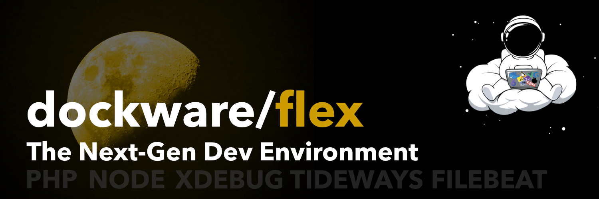

# Dockware Flex



[](https://github.com/dockware/dockware/blob/master/LICENSE)


Welcome to Dockware Flex! For more information, visit [dockware.io](https://dockware.io).

## What is Dockware Flex?

Dockware Flex is designed to provide developers with an optimal environment that includes multiple "latest" PHP and Node.js versions, Xdebug, and essential tools. Its goal is to streamline development workflows with an up-to-date and clean setup.

### Key Features:

- Nightly builds (`dev-main`) for cutting-edge updates.
- Semantic versioning releases (e.g., `2.0.0`, `2.0.1`, etc.).
- Comprehensive changelog available in `CHANGELOG.md`.
- Legacy-free design: removes outdated components like PHP 5.6.
- Flexibility for modern development while continuously evolving with new tools and removing outdated ones.

The original Dockware Flex image is available with the tag `legacy`.

## Releases and Versions

Dockware Flex has two main types of releases:

1. **Nightly Builds**: Available with the tag `dev-main`.
2. **Stable Versions**: Versioned releases like `2.0.0`, `2.0.1`, etc.

Check the `CHANGELOG.md` file for details on all changes and updates. The changelog is also included within the image.

## Documentation and Resources

Explore more about Dockware Flex:

- **Website**: [dockware.io](https://dockware.io)
- **Documentation**: Detailed guides and resources are available on the website.
- **Images**: Official image listings and build information can be found at [dockware.io/images](https://dockware.io/images).

## Contribution

Contributions are welcome! Please refer to the `CONTRIBUTING.md` file for guidelines on how to contribute effectively.

## Features

### Switch PHP

```bash 
cd /var/www
make switch-php version=8.2
```

### Switch Node

```bash
cd /var/www
make switch-node version=20
```

### Supervisor

```bash
ENV SUPERVISOR_ENABLED=1

volume: /etc/supervisor/supervisord.conf

[program:my-worker-process]
process_name=%(program_name)s_%(process_num)02d
command=php bin/console xyz
directory=/var/www/html
user=www-data
group=www-data
numprocs=2
autostart=true
autorestart=true
stdout_logfile=/var/log/worker.out.log
stderr_logfile=/var/log/worker.err.log
```

### Conjobs

docker cp ./dev/config/shop/crontab.txt container:/var/www/crontab.txt
docker exec -it container bash -c 'crontab /var/www/crontab.txt && sudo service cron restart'

### Filebeat

/etc/filebeat/filebeat.yml

name: "shop"

filebeat.inputs:

- type: log
  enabled: true
  paths:
    - /var/www/html/var/log/*.log
      tags: ["shop"]

output.logstash:
hosts: ["logstash:5044"]

### SSH User

### Tideways

### XDebug

#### 1. Enable/Disable XDebug

You can either enable Xdebug initially by setting the ENV variable `XDEBUG_ENABLED` to 1 (ON) or 0 (OFF) or by executing the following
command in an existing container:

```bash 
cd /var/www
make xdebug-on
make xdebug-off
```


### Set Custom Timezone

### Recovery Mode

### Set Custom Apache DocRoot

## License

Dockware Flex is provided under the MIT license. As with all Docker images, this project may include software under other licenses. Users are responsible for ensuring compliance with all relevant licenses for software contained within the image.